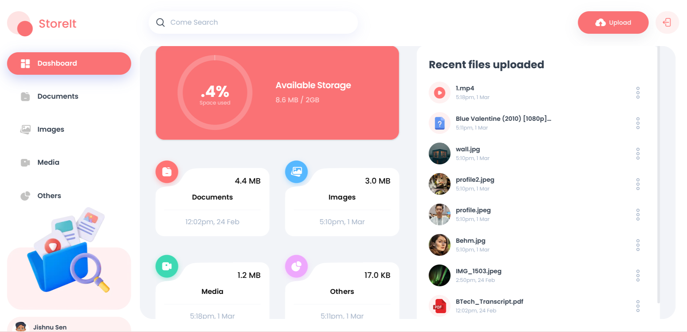
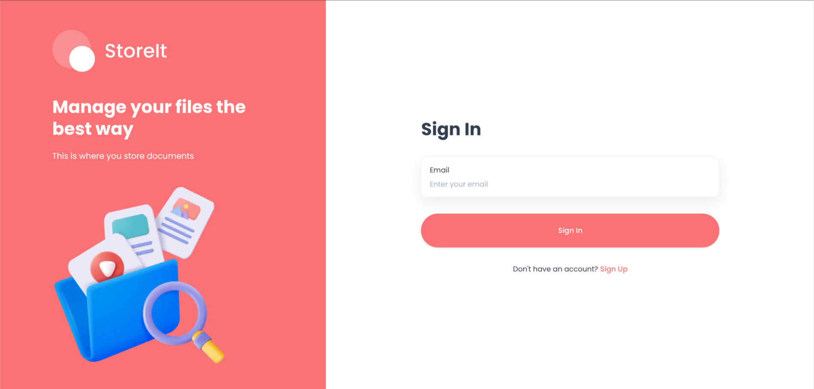
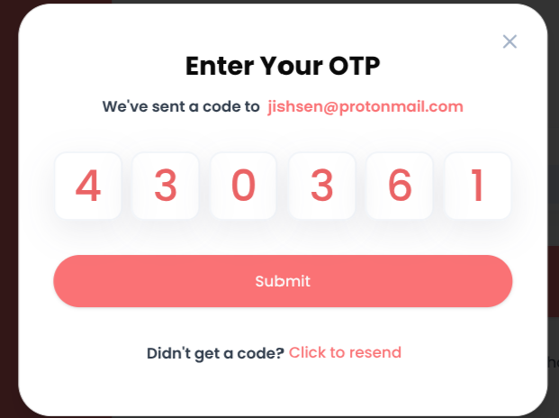
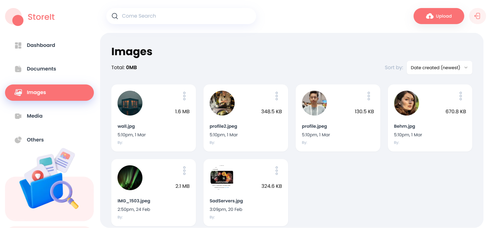
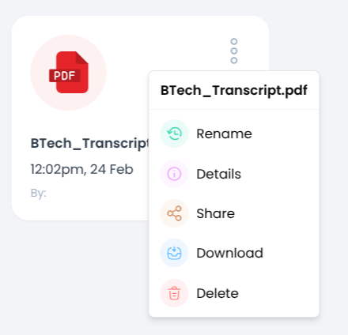
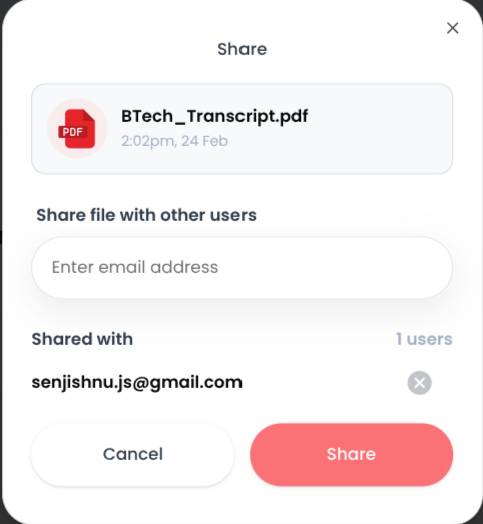
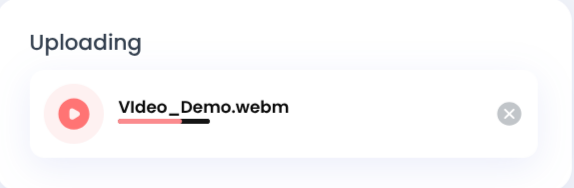

<div align="center">

  <p>A modern cloud storage and file management platform built with Next.js and Appwrite.</p>

  <p>
    <a href="https://cloud-storage-omega-five.vercel.app/sign-in"><strong>Live Demo</strong></a> •
    <a href="#features">Features</a> •
    <a href="#tech-stack">Tech Stack</a> •
    <a href="#getting-started">Getting Started</a> •
    <a href="#environment-variables">Environment Variables</a> •
    <a href="#deployment">Deployment</a>
  </p>


</div>

---

## Overview

Full-featured cloud storage web application that lets users securely upload, organize, search, and share files — all from a clean, responsive interface. It supports multiple file types including documents, images, videos, and audio, with a real-time dashboard that visualizes storage usage.



---

## Features

- **Passwordless Auth** — Email-based sign-in with OTP verification; no passwords required.
- **File Upload** — Drag-and-drop uploads with support for up to 50 MB per file.
- **File Management** — Rename, delete, download, and share files with other users.
- **File Categories** — Automatically organized into Documents, Images, Media, and Others.
- **Real-Time Search** — Debounced search across all your files with instant results.
- **Flexible Sorting** — Sort by date, name, or file size in ascending or descending order.
- **Storage Dashboard** — Radial chart showing total storage used across all file types.
- **File Sharing** — Grant access to specific files by entering another user's email.
- **Responsive Design** — Fully functional on desktop, tablet, and mobile devices.

---

## Tech Stack

| Category          | Technology                                                                     |
| ----------------- | ------------------------------------------------------------------------------ |
| Framework         | [Next.js 15](https://nextjs.org/) (App Router)                                 |
| Language          | [TypeScript 5](https://www.typescriptlang.org/)                                |
| Styling           | [Tailwind CSS](https://tailwindcss.com/) + [Shadcn/ui](https://ui.shadcn.com/) |
| Backend & Storage | [Appwrite](https://appwrite.io/) (Auth, Database, File Storage)                |
| Forms             | [React Hook Form](https://react-hook-form.com/) + [Zod](https://zod.dev/)      |
| Charts            | [Recharts](https://recharts.org/)                                              |
| File Uploads      | [React Dropzone](https://react-dropzone.js.org/)                               |
| Notifications     | [Sonner](https://sonner.emilkowal.ski/)                                        |

---

## Screenshots








---

## Getting Started

### Prerequisites

- [Node.js 18+](https://nodejs.org/)
- An [Appwrite](https://appwrite.io/) account (Cloud or self-hosted)

### Appwrite Setup

1. Create a new **Appwrite project**.
2. Enable **Email OTP** as an authentication method under **Auth → Settings**.
3. Create a **Storage bucket** (set the maximum file size to 50 MB).
4. Create a **Database** with two collections:

   **`users` collection attributes:**
   | Attribute | Type | Required |
   |---|---|---|
   | fullName | String | Yes |
   | email | String | Yes |
   | avatar | String | Yes |
   | accountId | String | Yes |

   **`files` collection attributes:**
   | Attribute | Type | Required |
   |---|---|---|
   | name | String | Yes |
   | url | String | Yes |
   | type | String | Yes |
   | bucketFileId | String | Yes |
   | accountId | String | Yes |
   | owner | Relationship (users) | Yes |
   | users | String[] | No |
   | size | Integer | Yes |
   | extension | String | Yes |

5. Create an **API Key** with full permissions to use server-side.

### Installation

```bash
# 1. Clone the repository
git clone https://github.com/Psybernetic7/cloud-storage.git
cd store_it

# 2. Install dependencies
npm install

# 3. Create your environment file
cp .env.example .env.local

# 4. Fill in your environment variables (see below)

# 5. Start the development server
npm run dev
```

Open [http://localhost:3000](http://localhost:3000) in your browser.

---

## Environment Variables

Create a `.env.local` file in the project root with the following variables:

```env
NEXT_PUBLIC_APPWRITE_ENDPOINT=https://cloud.appwrite.io/v1
NEXT_PUBLIC_APPWRITE_PROJECT=your_project_id
NEXT_PUBLIC_APPWRITE_DATABASE=your_database_id
NEXT_PUBLIC_APPWRITE_USERS_COLLECTION=your_users_collection_id
NEXT_PUBLIC_APPWRITE_FILES_COLLECTION=your_files_collection_id
NEXT_PUBLIC_APPWRITE_BUCKET=your_bucket_id
NEXT_APPWRITE_SECRET=your_api_key_secret
```

> **Note:** Variables prefixed with `NEXT_PUBLIC_` are exposed to the browser. The `NEXT_APPWRITE_SECRET` key is server-only and should never be committed or exposed publicly.

---

## Project Structure

```
store_it/
├── app/
│   ├── (auth)/               # Sign-in and sign-up pages
│   └── (root)/               # Protected app pages
│       ├── page.tsx          # Dashboard
│       └── [type]/page.tsx   # Dynamic file category pages
├── components/               # Reusable UI components
│   ├── ui/                   # Shadcn primitives
│   ├── AuthForm.tsx
│   ├── FileUploader.tsx
│   ├── Chart.tsx
│   ├── Search.tsx
│   ├── ActionDropdown.tsx
│   └── ...
├── lib/
│   ├── actions/              # Server actions (file & user operations)
│   └── appwrite/             # Appwrite client configuration
├── constants/                # App-wide constants
├── types/                    # TypeScript type definitions
└── public/assets/            # Static icons and images
```

---
